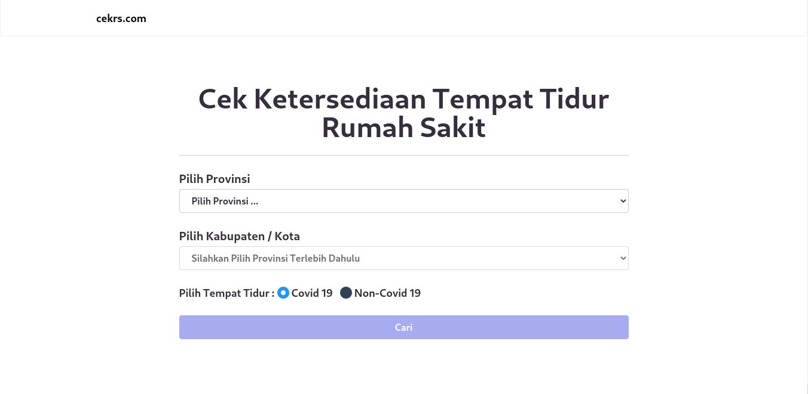

# Cek RS Indonesia



Sebuah Website yang memberikan informasi terkait ketersediaan rumah sakit dan tempat tidur rumah sakit untuk pasien covid-19 ataupun non-covid di Indonesia.

## Instalasi

1. Klon repositori ini <br />

   ```
   git clone https://github.com/saepp/cek.rs.git
   ```

2. Unduh semua dependensi <br />

   ```
   npm
   ```

3. Konfigurasi _file_ `.env` <br />

   ```
   NEXT_PUBLIC_API_URL = ''
   ```

4. Jalankan _project_ <br />

   ```
   npm run dev
   ```

## Teknologi yang digunakan

- [Next.js](https://nextjs.org/)
- [Tailwind CSS](https://tailwindcss.com/)

## Fitur

- [x] Menampilkan daftar rumah sakit berdasarkan provinsi dan kabupaten / kota.
- [x] Menampilkan detail rumah sakit.

## Sumber data

Sumber data website ini berasal dari publik API: [satyawikananda/rs-bed-covid-indo-api](https://github.com/satyawikananda/rs-bed-covid-indo-api).

## Kontribusi

Jika menemukan _bug_ atau kesalahan silahkan lapor ke _issue_ atau jika ingin berkontribusi silahkan buat _pull request_.

## Referensi

- [Ina Covid Bed](https://github.com/agallio/ina-covid-bed)

---

Kode ini berlisensi di bawah [MIT License](LICENSE).
